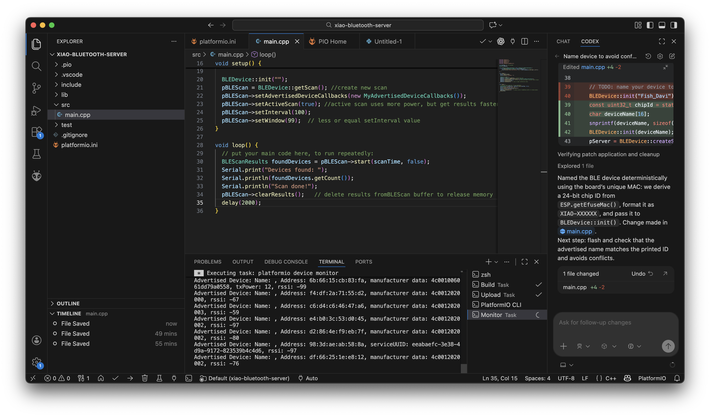
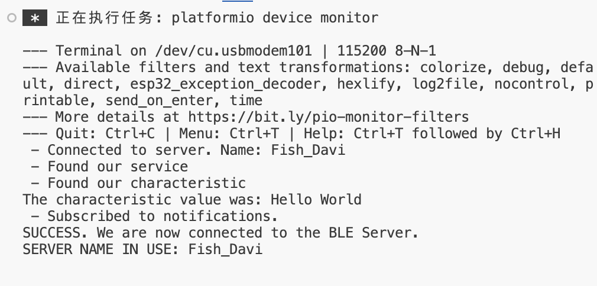
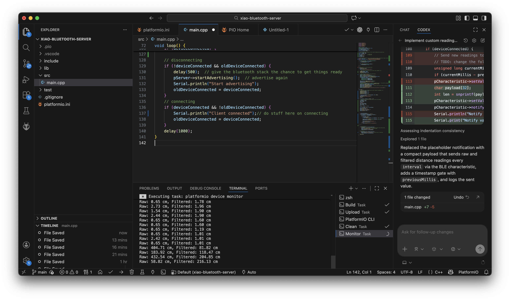
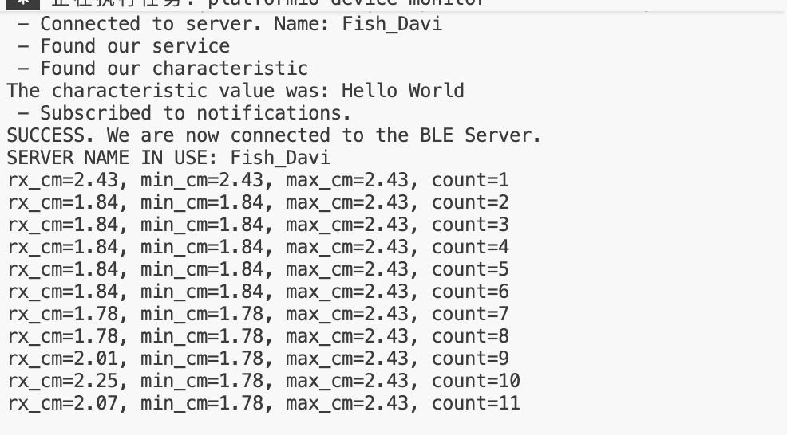

# Wireless-Lab

Team member: Sijia Shao, Davi Dai

https://github.com/FishShao/Wireless-Lab

Screenshot of your serial monitor displaying the number of Bluetooth devices detected using your MCU as BLEScanner

Screenshot of the serial monitor of your client device to show a successful connection with your server device (make sure the server device's name is included).

Screenshot of the serial monitor of your server device to show the raw and denoised sensor data.

Screenshot of the serial monitor of your client device to show the current, maximum, and minimum data transmitted from your server device.

